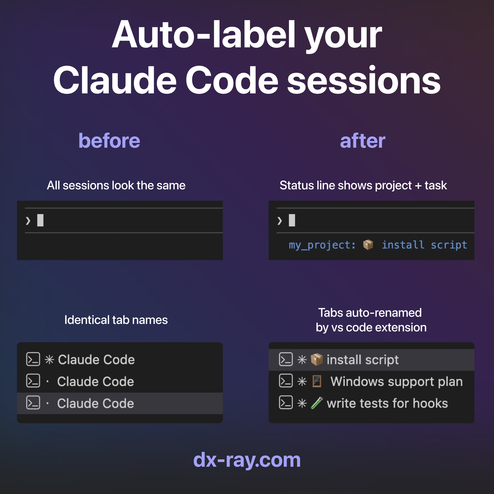
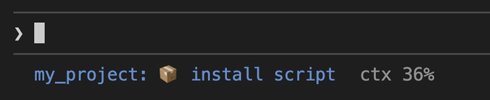

# Claude Session Labels

Auto-label your Claude Code sessions. See what each session is doing at a glance - in the status line, and optionally in VS Code terminal tabs.



## The Problem

When you have 3+ Claude Code sessions open, they all look the same. You can't tell which one is working on the auth bug and which is refactoring the API.

## How It Works

On the first prompt in a new session, Claude is asked to generate a short label (emoji + description) based on what you're working on. The label is saved to a JSON file and displayed in the Claude Code status line.

**Flow:**

1. You send a prompt to Claude Code
2. A `UserPromptSubmit` hook injects a labeling instruction (only on the first prompt)
3. Claude generates a label and saves it via `save-label.sh`
4. The status line reads the label and displays it with the project name and context usage (may take 1-2 messages to appear)

```
second_brain: fix auth bug  ctx 23%
```

## Features

- **Status line** - shows `project: emoji label` with a unique color per session (based on session ID hash), so sessions are visually distinct even at a glance
- **Context usage** - displays `ctx N%` so you know how much context window is left
- **Auto-labeling** - Claude generates a label from context on the first prompt
- **Persistent** - labels survive session resume (stored in `~/.claude/session-labels.json`)
- **VS Code tab rename** (optional) - renames terminal tabs via a local extension ([workaround](#vs-code-extension-optional))



## Prerequisites

- [Claude Code](https://docs.anthropic.com/en/docs/claude-code) CLI
- Python 3 (for hook scripts)
- macOS or Linux (Windows not yet tested)

## Quick Start

```bash
git clone https://github.com/dxrayhq/claude-session-labels.git
cd claude-session-labels
claude "install this"
```

Claude Code will read the [CLAUDE.md](CLAUDE.md), copy the hooks, merge settings into your config, and optionally install the VS Code extension.

Restart Claude Code and send any prompt. The label should appear in the status line after 1-2 messages.

<details>
<summary>Manual installation</summary>

### 1. Copy hook scripts

```bash
cp hooks/label-inject.py ~/.claude/hooks/
cp hooks/save-label.sh ~/.claude/hooks/
cp hooks/statusline.sh ~/.claude/hooks/
chmod +x ~/.claude/hooks/save-label.sh ~/.claude/hooks/statusline.sh
```

### 2. Configure Claude Code

Add these to your `~/.claude/settings.json`:

```jsonc
{
  "hooks": {
    "SessionStart": [
      {
        "hooks": [
          {
            "type": "command",
            // Exports CLAUDE_SESSION_ID so save-label.sh can use it
            "command": "bash -c 'INPUT=$(cat); SID=$(echo \"$INPUT\" | python3 -c \"import sys,json; print(json.load(sys.stdin).get(\\\"session_id\\\",\\\"\\\"))\" 2>/dev/null); if [ -n \"$SID\" ] && [ -n \"$CLAUDE_ENV_FILE\" ]; then echo \"export CLAUDE_SESSION_ID=\\\"$SID\\\"\" >> \"$CLAUDE_ENV_FILE\"; fi'",
          },
        ],
      },
    ],
    "UserPromptSubmit": [
      {
        "hooks": [
          {
            "type": "command",
            "command": "python3 ~/.claude/hooks/label-inject.py",
          },
        ],
      },
    ],
  },
  "permissions": {
    "allow": ["Bash(~/.claude/hooks/save-label.sh:*)"],
  },
  "statusLine": {
    "type": "command",
    "command": "~/.claude/hooks/statusline.sh",
  },
}
```

> **Note:** If you already have hooks or permissions configured, merge these entries into your existing config.

</details>

## VS Code Extension (Optional)

> **This is a workaround.** Currently there's no API to programmatically rename Claude Code terminal tabs. This extension sends `/rename` commands via `terminal.sendText()`, which **steals focus** briefly. If you find that disruptive, use only the status line.
>
> Tracking issue: [anthropics/claude-code#25045](https://github.com/anthropics/claude-code/issues/25045)

The extension watches `session-labels.json` and `session-status.json` for changes. It sends `/rename` only when Claude is idle (after the `Stop` hook fires), preventing interruption of Claude's work.

### Install

```bash
# Copy to VS Code extensions directory
cp -r vscode-extension ~/.vscode/extensions/claude-session-labels

# Reload VS Code (Cmd+Shift+P -> "Reload Window")
```

### How it works

1. `label-inject.py` writes a `shell PID -> session ID` mapping and sets status to `"working"`
2. `session-status.py` (Stop hook) sets status to `"idle"` when Claude finishes
3. The extension watches both files and sends `/rename` only when status is `"idle"`
4. Pattern: text, 300ms pause, Escape (dismiss autocomplete), 100ms pause, Enter (submit)
5. Renamed sessions are tracked in VS Code's `globalState` (keyed by session_id), surviving reloads

### Known limitations

- **Focus stealing**: VS Code switches focus to the terminal when sending text. No public API workaround exists.
- **First prompt only**: PID mapping is created on the first prompt. Terminals opened before any prompt won't be mapped.

## Customization

### Change the label prompt

Edit the instruction template at the bottom of `hooks/label-inject.py`. The default asks for an emoji + short description of what the user wants to do.

### Status line format

Edit `hooks/statusline.sh` to change what's displayed. The script receives JSON on stdin with `session_id`, `cwd`, and `context_window` fields.

## File Reference

| File                              | Purpose                                                                  |
| --------------------------------- | ------------------------------------------------------------------------ |
| `~/.claude/hooks/label-inject.py`  | UserPromptSubmit hook: injects labeling instruction + writes PID mapping + sets "working" status |
| `~/.claude/hooks/save-label.sh`    | Called by Claude to persist the label                                                           |
| `~/.claude/hooks/session-status.py`| Stop hook: sets session status to "idle" when Claude finishes                                   |
| `~/.claude/hooks/statusline.sh`    | Status line: reads label and displays it                                                        |
| `~/.claude/session-labels.json`    | Label store: `{session_id: "emoji label"}` (created automatically)                              |
| `~/.claude/session-status.json`    | Session status: `{session_id: "working"|"idle"}` (created automatically)                        |
| `~/.claude/pid-to-session.json`    | PID mapping: `{shell_pid: session_id}` (created automatically)                                  |

## Alternatives & Related

|                                    | claude-session-labels (this)                   | [claude-code-terminal-title](https://github.com/bluzername/claude-code-terminal-title) |
| ---------------------------------- | ---------------------------------------------- | -------------------------------------------------------------------------------------- |
| **Approach**                       | Claude Code hooks + statusline API             | Skill (SKILL.md) + zsh precmd patch                                                    |
| **Where labels show**              | Status line (built-in) + VS Code tabs          | Terminal window title (OSC sequences)                                                  |
| **Works in VS Code**               | Yes (status line + tab rename)                 | No (Ink overwrites OSC on every render)                                                |
| **Works in iTerm2 / Terminal.app** | Status line only (window title unchanged)      | Window title via precmd race with Ink                                                  |
| **Auto-generates labels**          | Yes (hook injects instruction on first prompt) | Yes (skill instructs Claude)                                                           |
| **Requires patching .zshrc**       | No                                             | Yes (setup-zsh.sh)                                                                     |
| **Context usage**                  | Yes (`ctx N%` in status line)                  | No                                                                                     |
| **Session color coding**           | Yes (hash-based per-session color)             | No                                                                                     |
| **Persistence across resume**      | Yes (JSON store)                               | File-based (5 min freshness window)                                                    |

**TL;DR:** This project uses Claude Code's built-in statusline API, which Ink can't overwrite. `claude-code-terminal-title` uses OSC escape sequences for the terminal window title, which requires a zsh precmd hook to keep re-applying (because Ink overwrites them on render). Different trade-offs - can be used together.

## License

MIT - [DX-Ray](https://dx-ray.com)
